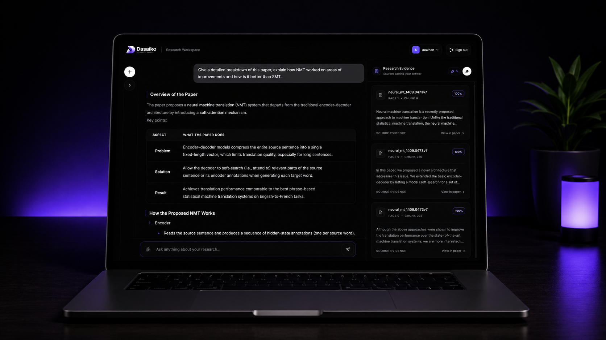
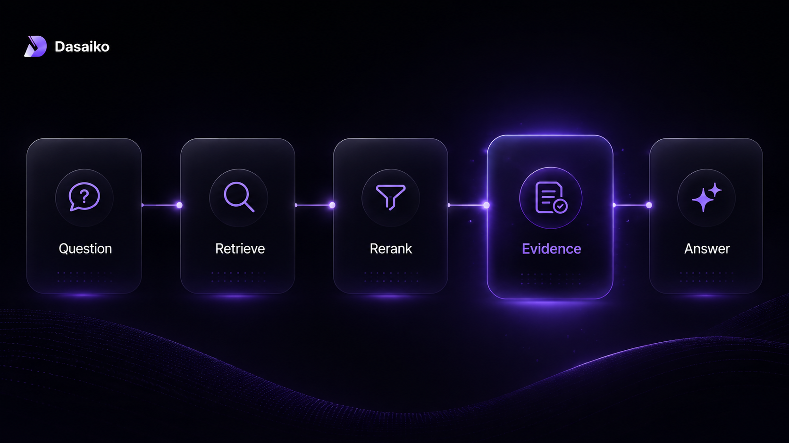
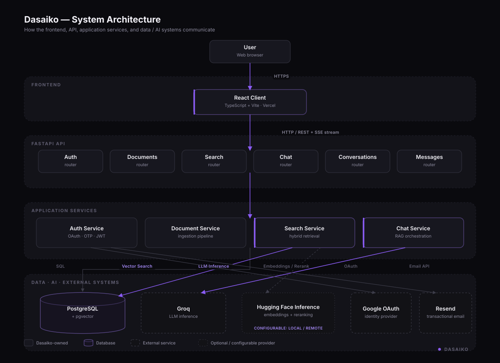
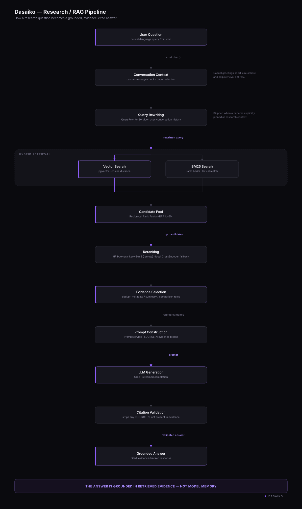
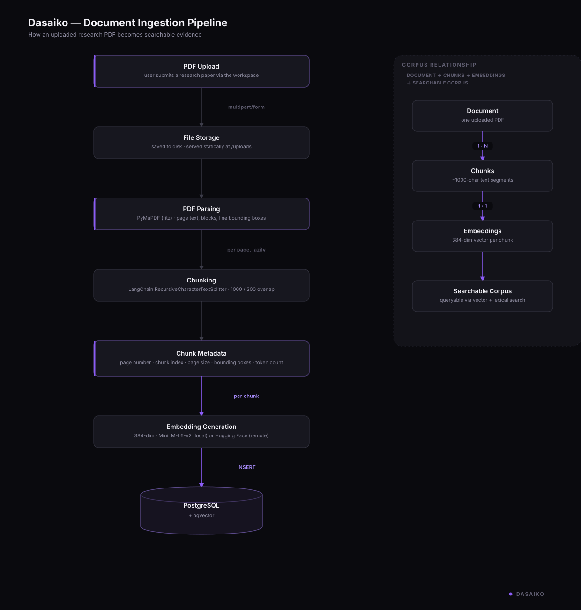
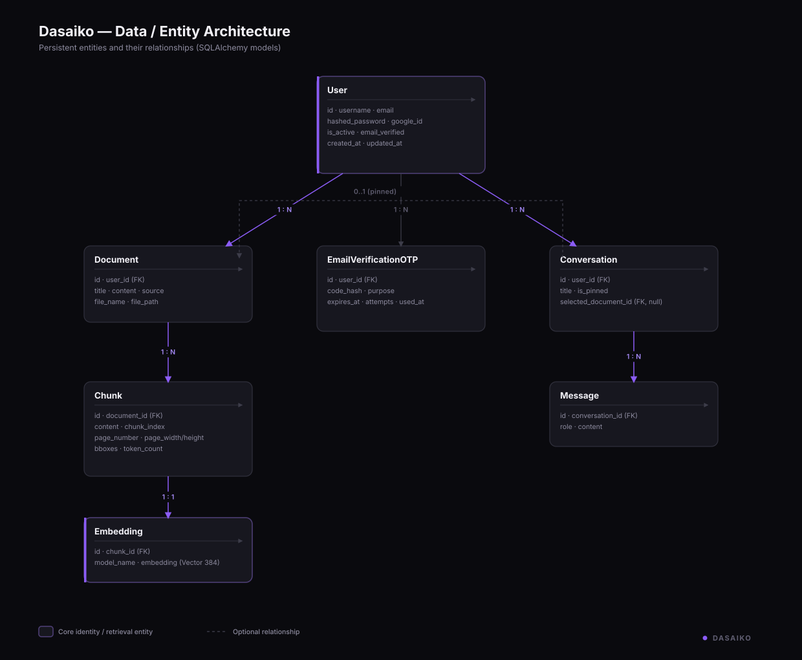

# Dasaiko

<p align="center">
  
</p>

<h1 align="center">Dasaiko</h1>

<p align="center"><strong>AI-powered research workspace for reading, questioning, and understanding research papers.</strong></p>

<p align="center">
  <a href="https://www.dasaiko.dev">
    
  </a>
  <a href="https://github.com/aawhan0/Dasaiko">
    
  </a>
  <a href="./docs/architecture.md">
    
  </a>
  <a href="https://www.linkedin.com/in/aawhanvyas/">
    
  </a>
</p>

<p align="center">
  
  
  
</p>

<p align="center"><sub>Grounded answers · Hybrid retrieval · Research context · Evidence-first workflow</sub></p>

---

## Why Dasaiko?

Research papers are difficult to work with when the interface between the researcher and the source becomes a generic chatbot.

Dasaiko is built around a different idea:

> **AI should help you interrogate the paper without disconnecting you from the paper.**

The workspace combines document-aware retrieval, hybrid search, reciprocal rank fusion, cross-encoder reranking, persistent research context, streaming responses, and page-level evidence into one research workflow.

### What you can do

| Capability | Purpose |
|---|---|
| **Paper-aware chat** | Ask questions against the research paper you are currently studying. |
| **Hybrid retrieval** | Combine semantic and lexical retrieval through Vector Search + BM25 + RRF. |
| **Cross-encoder reranking** | Refine candidate relevance before evidence reaches the LLM. |
| **Evidence-first answers** | Inspect the source chunks behind a generated response. |
| **Context-aware routing** | Keep retrieval scoped to the active paper unless the user explicitly changes scope. |
| **Query-aware retrieval** | Use specialized strategies for metadata, summaries, and comparisons. |

## Product Showcase

<p align="center">
  
</p>

Dasaiko keeps the paper, conversation, retrieval context, and evidence in the same research workspace rather than hiding the source behind a generic chat interface.

## Research Flow

```text
Upload a paper
      ↓
Select research context
      ↓
Ask a question
      ↓
Query analysis + routing
      ↓
Vector Search + BM25
      ↓
RRF candidate fusion
      ↓
BGE cross-encoder reranking
      ↓
Evidence selection
      ↓
Grounded LLM response
      ↓
Inspect the source
```

<p align="center">
  
</p>

---

# Architecture

Dasaiko separates the **research workspace**, **application services**, **retrieval and reasoning pipeline**, and **persistent evidence layer**.

The full architecture reference is available in [`docs/architecture.md`](./docs/architecture.md).

## System Architecture

<p align="center">
  
</p>

The system architecture shows the runtime boundaries between the frontend, FastAPI backend, application services, database, and external inference/authentication providers.

## Research Pipeline

<p align="center">
  
</p>

The important architectural boundary is that the LLM receives **selected research evidence**, rather than being treated as the source of truth.

## Document Ingestion

<p align="center">
  
</p>

Research documents enter Dasaiko through a structured ingestion path:

```text
Document
   ↓
Parsed content + metadata
   ↓
Chunks
   ↓
Embeddings
   ↓
Searchable corpus
```

## Data Architecture

<p align="center">
  
</p>

Users own research documents and conversations; documents are decomposed into chunks and embeddings; conversations contain messages; and verification state supports authentication.

---

## Retrieval Engineering

Dasaiko deliberately separates **candidate retrieval** from **fine-grained relevance ranking**.

```text
                         USER QUERY
                             │
                    ┌────────┴────────┐
                    ▼                 ▼
              Vector Search         BM25
                 Top 50             Top 50
                    │                 │
                    └────────┬────────┘
                             ▼
                         RRF Fusion
                         k = 60
                             │
                             ▼
                    Hybrid Candidate Pool
                             │
                             ▼
                    BGE Cross-Encoder
                         Reranking
                             │
                             ▼
                    RRF + BGE Fusion
                         0.50 / 0.50
                             │
                             ▼
                    Duplicate Filtering
                             │
                             ▼
                      Top-K Evidence
                             │
                             ▼
                        Grounded LLM
```

### Why hybrid retrieval?

Vector search handles semantic similarity. BM25 handles exact terminology, technical phrases, names, and keyword-sensitive queries.

RRF combines their **rankings** rather than pretending their raw scores are directly comparable.

### Why rerank?

Initial retrieval optimizes recall. A cross-encoder can then evaluate the query and passage together to refine the ordering of the candidate pool.

```text
Vector + BM25 → broad retrieval
RRF           → ranking fusion
BGE           → semantic refinement
Evidence      → grounded context
LLM           → answer generation
```

## Context-Aware Retrieval

A research assistant should know **which paper the researcher is talking about**.

- **Selected paper:** normal questions remain scoped to the active research paper.
- **Explicit paper reference:** when the user refers to another uploaded paper, Dasaiko resolves that document and scopes retrieval to it for the current query.
- **External or global research:** retrieval scope is expanded only when the user explicitly asks for broader research context.

This prevents unrelated uploaded documents from silently becoming evidence for a question about the active paper.

## Query-Aware Retrieval

Not every question benefits from the same retrieval strategy.

**Metadata queries** prioritize front-matter content for questions about titles, authors, publication details, and similar fields.

**Summary queries** prioritize abstract, introduction, motivation, main findings, conclusions, and nearby coherent passages.

**Comparison queries** are enriched to favor complementary evidence covering mechanisms, objectives, training procedures, strengths, limitations, and outcomes on each side of the comparison.

## Evidence and Citations

Every evidence object preserves enough information to trace a generated answer back to the source:

- document identity and title
- chunk and chunk index
- page number
- page dimensions
- bounding boxes
- retrieval and ranking scores
- source preview

Dasaiko also validates source references before returning the final answer so unsupported or malformed citations are not silently passed downstream.

---

## Evaluation

The retrieval architecture was selected through measurement rather than assumption.

The benchmark compares dense retrieval, lexical retrieval, hybrid fusion, local cross-encoder reranking, and remote BGE reranking using the same relevance benchmark.

### Metrics

| Metric | Meaning |
|---|---|
| **Recall@5** | Relevant evidence appears within the top 5 results. |
| **Recall@10** | Relevant evidence appears within the top 10 results. |
| **MRR** | Rewards a highly ranked first relevant result. |
| **nDCG@10** | Measures ranking quality across the top 10 results. |

### Benchmark results

| Method | Recall@5 | Recall@10 | MRR | nDCG@10 |
|---|---:|---:|---:|---:|
| Vector Search | 0.4017 | 0.5850 | 0.5088 | 0.4379 |
| BM25 | 0.2033 | 0.2908 | 0.2531 | 0.1975 |
| RRF | 0.4008 | 0.6033 | 0.4706 | 0.4132 |
| Local Cross-Encoder | 0.6325 | 0.8017 | 0.7780 | 0.6850 |
| **Remote BGE Reranker** | **0.7442** | **0.8492** | **0.8220** | **0.7592** |

### What the reranker changed

| Metric | RRF | RRF + BGE | Relative improvement |
|---|---:|---:|---:|
| Recall@5 | 0.4008 | **0.7442** | **+85.65%** |
| Recall@10 | 0.6033 | **0.8492** | **+40.75%** |
| MRR | 0.4706 | **0.8220** | **+74.67%** |
| nDCG@10 | 0.4132 | **0.7592** | **+83.74%** |

The measured results support the current architecture:

```text
Vector Search + BM25
          ↓
         RRF
          ↓
   BGE Cross-Encoder
          ↓
    Top-K Evidence
          ↓
         LLM
```

The benchmark is an engineering evaluation of Dasaiko's current relevance set, not a universal claim that one reranker is best for every retrieval problem.

<details>
<summary><strong>Engineering decisions</strong></summary>

### Why Vector Search + BM25?

Semantic retrieval and lexical retrieval fail differently. Combining them broadens candidate recall and improves robustness across conceptual and exact-match questions.

### Why RRF?

RRF lets Dasaiko combine rankings without forcing dense and lexical scores onto an artificial shared scale.

### Why BGE?

The cross-encoder directly evaluates query-passage relevance and produced the strongest measured ranking performance on the current benchmark.

### Why keep a local fallback?

Reranking is an optimization layer rather than a hard dependency. When remote inference is unavailable, Dasaiko can preserve the existing hybrid ranking instead of failing the entire RAG request.

</details>

---

## Tech Stack

| Layer | Technology |
|---|---|
| Frontend | React, Vite, Tailwind CSS |
| Backend | Python, FastAPI, SQLAlchemy, Alembic |
| Database | PostgreSQL, pgvector |
| Retrieval | Sentence Transformers, Vector Search, BM25, RRF |
| Reranking | BGE Cross-Encoder |
| LLM | Groq |
| Streaming | Server-Sent Events |
| Deployment | Vercel + Render |
| Local infrastructure | Docker / Docker Compose |

---

## Project Structure

```text
Dasaiko/
├── backend/
│   ├── app/
│   │   ├── api/
│   │   ├── core/
│   │   ├── db/
│   │   ├── models/
│   │   ├── rag/
│   │   ├── schemas/
│   │   ├── services/
│   │   ├── utils/
│   │   └── main.py
│   ├── evaluation/
│   ├── alembic/
│   ├── Dockerfile
│   └── requirements.txt
│
├── frontend/
├── docs/
│   ├── architecture.md
│   └── assets/
├── docker-compose.yml
└── README.md
```

---

## Deployment

```text
             https://www.dasaiko.dev
                        │
                      Vercel
                        │
                        │ HTTPS
                        ▼
            https://dasaiko-api.onrender.com
                        │
                      Render
                        │
                        ▼
              PostgreSQL + pgvector
```

---

## Getting Started

### Prerequisites

- Python 3.11+
- Node.js 20+
- Docker / Docker Compose
- Groq API key

### Run locally

```bash
git clone https://github.com/aawhan0/Dasaiko.git
cd Dasaiko

docker compose up -d
```

Backend:

```bash
cd backend
cp .env.example .env
pip install -r requirements.txt
uvicorn app.main:app --reload
```

Frontend:

```bash
cd frontend
npm install
npm run dev
```

The frontend expects `VITE_API_BASE_URL` to point at the backend API.

---

## Evaluation Tooling

Retrieval evaluation lives under `backend/evaluation/` and is designed to reproduce the production retrieval path rather than evaluate isolated components in a vacuum.

```text
Query
  ↓
Vector Search + BM25
  ↓
RRF
  ↓
BGE Cross-Encoder
  ↓
Score Fusion
  ↓
Evidence Selection
  ↓
LLM Context
```

The suite keeps retrieval behavior observable and makes future improvements measurable.

---

## Design Principles

**Ground answers in sources.** Evidence should remain inspectable.

**Preserve research context.** The conversation should know which paper is active.

**Improve retrieval before prompting.** Better evidence is a stronger foundation than endlessly expanding the prompt.

**Separate retrieval responsibilities.** Vector Search, BM25, RRF, and reranking each solve a different problem.

**Keep the researcher connected to the paper.** The goal is to make original research easier to read, question, navigate, compare, and understand.

---

## Roadmap

- [x] PDF upload and document management
- [x] Paper-aware chat and research context
- [x] Hybrid Vector + BM25 retrieval
- [x] RRF fusion
- [x] BGE reranking
- [x] Evidence and source citation flow
- [x] Retrieval evaluation suite
- [x] Production deployment
- [ ] Production-grade evidence-to-PDF interaction polish
- [ ] Rich visual research maps
- [ ] Expanded evaluation coverage
- [ ] Public documentation

---

## License

MIT License. See [`LICENSE`](./LICENSE).

---

<p align="center"><sub>Built as an engineering project to make paper-driven research more grounded, inspectable, and useful.</sub></p>
